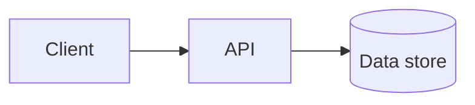

# Design — 〈area, e.g. System Architecture〉

> Epic: #1 · Stories: #3
> Owner: 〈name〉 · Sprint: 3 · Status: draft

## Overview

〈One paragraph plus a diagram. Commit diagram sources (mermaid/drawio/png)
next to this file.〉

## Components

| Component | Responsibility | Interfaces |
|---|---|---|
| 〈…〉 | 〈…〉 | 〈…〉 |

## Data model

〈Entities, key fields, relationships.〉

## Key decisions

| Decision | Options considered | Chosen | Why |
|---|---|---|---|
| 〈…〉 | 〈…〉 | 〈…〉 | 〈…〉 |
